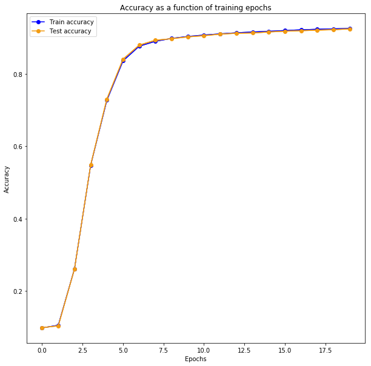
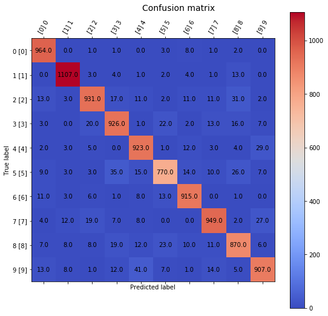

# Neural-Network-Implementation

### Installation
- To download MNIST data, install [python-mnist](https://pypi.org/project/python-mnist/) through `git clone` method (run the script to download data; ensure `python-mnist` directory exists inside the same directory which contains this notebook)

### Introduction
- Notebook containing working implementation of a **vectorized fully-connected neural network** in NumPy
- Backpropagation algorithm is implemented in a **full-vectorized fashion over a given minibatch**
- This enables us to take advantage of powerful built-in NumPy APIs (and avoid clumsy nested loops!), consequently improving training speed
- Backpropagation code lies in method *take_gradient_step_on_minibatch* of class _NeuralNetwork_
- Refer to in-code documentation and comments for description of how the code is working

### Contents
1. Implement class _NeuralNetwork_
2. Implement common activation and loss functions
3. Test implementation on MNIST data

### Results
- 1 hidden-layer (256 dimensional) with sigmoid activation on MNIST data

